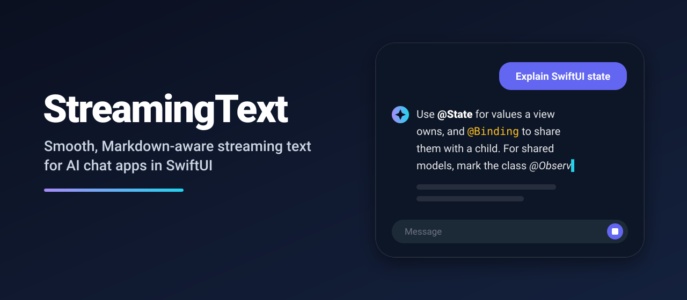
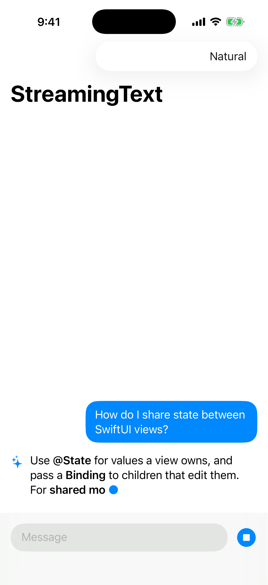
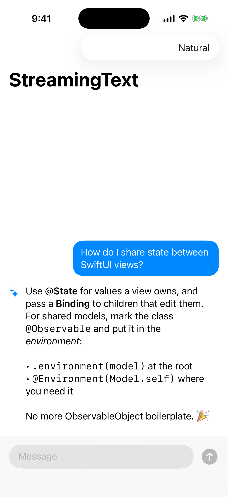
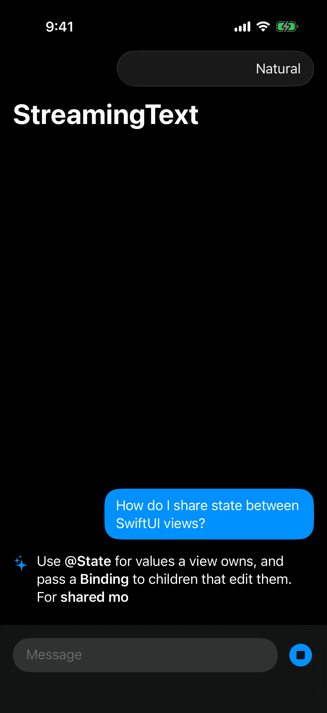

<p align="center">
  
</p>

<p align="center">
  <a href="https://github.com/halilozel1903/StreamingText/actions/workflows/ci.yml"></a>
  
  
  
  
  <a href="LICENSE"></a>
</p>

**StreamingText** makes LLM responses in your SwiftUI app feel like ChatGPT or Claude: tokens flow in at a steady, human rhythm, half-written Markdown never flickers, and the text never falls behind the network.

```swift
@State private var reply = StreamingTextModel()

StreamingTextView(reply)
    .task { try? await reply.stream(client.streamResponse(for: prompt)) }
```

## Screenshots

Captured from the example chat app on an iOS 26 simulator by CI.

| Mid-stream (healed Markdown + caret) | Finished answer | Dark mode |
| :---: | :---: | :---: |
|  |  |  |

## Why

Token streams are bursty. A naive `text += delta` makes the UI stutter: nothing for 400 ms, then a whole sentence at once, with raw `**` and `` ` `` characters blinking in and out while Markdown is incomplete. StreamingText sits between your network layer and your view and fixes all of that.

## Features

- ⌨️ **Adaptive pacing**: a steady typing speed that automatically speeds up when the backlog grows, so the display lags at most `catchUpDuration` seconds.
- 🩹 **Markdown healing**: closes open `**bold`, `*italic`, `~~strike` and `` `code `` on every frame, and hides markers that have no content yet.
- 🧬 **Grapheme safe**: emoji, flags and combining accents are never split, even across chunk boundaries.
- 🔌 **Works with any `AsyncSequence`**: OpenAI, Anthropic, Apple Foundation Models, your own SSE parser.
- ⏹ **Skip & stop**: `revealAll()` finishes instantly; cancelling the task stops the stream.
- ▍ **Blinking caret** (`.block`, `.dot`, `.bar` or your own) while text is active.
- ♿️ VoiceOver reads the full text, not the half-typed frame.
- 🧵 Swift 6 strict concurrency, `@Observable`, zero dependencies, tested with Swift Testing.

## Installation

Add the package in Xcode via **File › Add Package Dependencies…**:

```
https://github.com/halilozel1903/StreamingText
```

or in `Package.swift`:

```swift
.package(url: "https://github.com/halilozel1903/StreamingText", from: "1.0.0")
```

## Usage

### Stream an `AsyncSequence`

```swift
import StreamingText

struct AnswerView: View {
    let prompt: String
    @State private var answer = StreamingTextModel(pacing: .natural)

    var body: some View {
        ScrollView {
            StreamingTextView(answer, caret: .dot)
                .frame(maxWidth: .infinity, alignment: .leading)
                .padding()
        }
        .task {
            try? await answer.stream(MyLLMClient.stream(prompt))   // any AsyncSequence<String>
        }
    }
}
```

### Push chunks yourself

```swift
answer.beginReceiving()
for try await event in sseEvents {
    answer.append(event.delta)
}
answer.finishReceiving()
```

### Pacing presets

| Preset | Speed | Max lag |
| --- | --- | --- |
| `.natural` | 45 chars/s | 1.5 s |
| `.fast` | 120 chars/s | 0.6 s |
| `.instant` | no animation | 0 s |
| `.init(charactersPerSecond:catchUpDuration:)` | your call | your call |

### Messages from history

```swift
StreamingTextView(StreamingTextModel(text: savedMessage.body))
```

### Model state

| Property | Meaning |
| --- | --- |
| `displayedText` | What is on screen right now |
| `fullText` | Everything received so far |
| `isReceiving` | The source is still producing text |
| `isRevealing` | Buffered text is still being typed |
| `isActive` | Either of the above; the caret shows while this is `true` |

### Use the pieces on their own

Both building blocks are public, pure value types:

```swift
MarkdownHealer.heal("This is **impor")        // "This is **impor**"
MarkdownHealer.heal("Hello **")               // "Hello "

var buffer = StreamingTextBuffer(pacing: .fast)
buffer.append("Hello")
buffer.advance(by: 1 / 60)                    // reveal what is due this frame
```

## Example app

`Example/` contains a small chat app with a fake LLM that streams bursty tokens, a speed picker and a stop button. Generate the project with [XcodeGen](https://github.com/yonaskolb/XcodeGen):

```bash
brew install xcodegen
cd Example && xcodegen generate
open StreamingTextDemo.xcodeproj
```

## Requirements

- Xcode 26+ (Swift 6.2)
- iOS 17+ / macOS 14+

## License

MIT. See [LICENSE](LICENSE).
